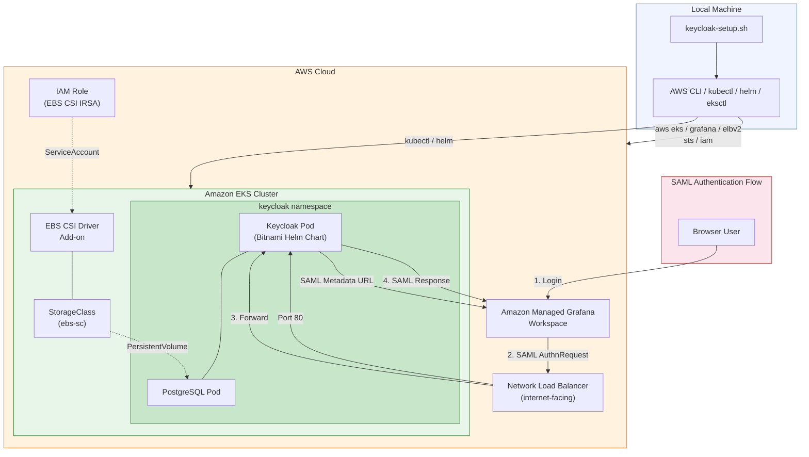

# Keycloak Setup for Amazon Managed Grafana (SAML)

This script automates the end-to-end deployment of [Keycloak](https://www.keycloak.org/) on an Amazon EKS cluster and configures SAML-based authentication for an [Amazon Managed Grafana](https://aws.amazon.com/grafana/) workspace.

Originally created for the [AWS One Observability Workshop](https://observability.workshop.aws/).

## Architecture



### Component Summary

| Component | Description |
|-----------|-------------|
| **keycloak-setup.sh** | Orchestrates the entire setup from the local machine |
| **Amazon EKS** | Hosts the Keycloak and PostgreSQL pods |
| **EBS CSI Driver** | Provides persistent storage for PostgreSQL via EBS volumes |
| **Network Load Balancer** | Exposes Keycloak on port 80 (internet-facing) |
| **Keycloak** | Identity provider serving SAML assertions for Grafana |
| **PostgreSQL** | Backend database for Keycloak (deployed as a sidecar via Helm) |
| **Amazon Managed Grafana** | Consumes SAML metadata from Keycloak for user authentication |
| **IAM (IRSA)** | Grants the EBS CSI driver permission to manage EBS volumes |

## What the Script Does

1. **Auto-installs missing CLI tools** — `kubectl`, `helm`, and `eksctl` are downloaded and installed automatically if not already present on the system.
2. **Resolves AWS context** — Detects the AWS account ID and region from the environment or AWS CLI configuration.
3. **Locates AWS resources** — Validates the specified EKS cluster and Amazon Managed Grafana workspace exist.
4. **Configures EBS CSI driver** — Creates the required IAM role (IRSA), installs the `aws-ebs-csi-driver` EKS add-on, and provisions a `StorageClass`.
5. **Deploys Keycloak via Helm** — Installs the Bitnami Keycloak chart (v24.2.3) with an internet-facing NLB and a bundled PostgreSQL database.
6. **Configures Keycloak for AMG** — Creates a realm, two test users (`admin` and `editor`), and a SAML client mapped to the Grafana workspace.
7. **Updates AMG SAML authentication** — Wires the Keycloak SAML metadata URL into the Grafana workspace authentication settings.
8. **Prints credentials** — Outputs the Keycloak admin password, realm user passwords, workspace URL, and SAML metadata URL.

## Prerequisites

The following must be available on the machine before running the script. The script validates these upfront:

| Tool | Purpose |
|------|---------|
| `aws` | AWS CLI for all AWS API calls |
| `jq` | JSON parsing |
| `curl` | Downloading binaries and health checks |
| `openssl` | Generating random passwords |
| `tar` | Extracting downloaded archives |
| `uname` | Detecting OS and architecture |

The following are auto-installed by the script if missing:

| Tool | Install Method |
|------|----------------|
| `kubectl` | Latest stable binary from `dl.k8s.io` (supports `amd64` and `arm64`) |
| `helm` | Official `get-helm-3` installer script from the Helm project |
| `eksctl` | Latest release binary from GitHub |

You also need:
- A configured AWS CLI session with sufficient IAM permissions.
- An existing Amazon EKS cluster.
- An existing Amazon Managed Grafana workspace.

## Usage

```bash
chmod +x keycloak-setup.sh

./keycloak-setup.sh \
  --cluster-name <EKS_CLUSTER_NAME> \
  --workspace-name <AMG_WORKSPACE_NAME> \
  [--account-id <AWS_ACCOUNT_ID>] \
  [--keycloak-namespace <NAMESPACE>] \
  [--keycloak-realm <REALM>]
```

## Options

| Flag | Description | Default |
|------|-------------|---------|
| `-c`, `--cluster-name` | Amazon EKS cluster name (required) | — |
| `-w`, `--workspace-name` | Amazon Managed Grafana workspace name (required) | — |
| `-a`, `--account-id` | AWS account ID | Auto-detected via STS |
| `-n`, `--keycloak-namespace` | Kubernetes namespace for Keycloak | `keycloak` |
| `-r`, `--keycloak-realm` | Keycloak realm name for AMG | `amg` |
| `-h`, `--help` | Show help message | — |

## Examples

Minimal (required flags only):

```bash
./keycloak-setup.sh -c my-eks-cluster -w my-grafana-workspace
```

Full options:

```bash
./keycloak-setup.sh \
  --cluster-name PetsiteEKS-cluster \
  --workspace-name amg-demo \
  --keycloak-namespace keycloak \
  --keycloak-realm amg \
  --account-id 123456789012
```

## Environment Variables

| Variable | Description |
|----------|-------------|
| `AWS_REGION` | AWS region (falls back to `AWS_DEFAULT_REGION`, then `aws configure get region`) |
| `ACCOUNT_ID` | AWS account ID (falls back to `aws sts get-caller-identity`) |

## Output

On successful completion the script prints:

- Amazon Managed Grafana workspace URL
- Keycloak master realm admin credentials
- Keycloak realm test user passwords (`admin` / `editor`)
- SAML metadata URL

## Line Endings

This script uses Unix (LF) line endings. No `dos2unix` conversion is needed when running on Linux.

## License

Copyright Amazon.com, Inc. or its affiliates. All Rights Reserved.
SPDX-License-Identifier: Apache-2.0
